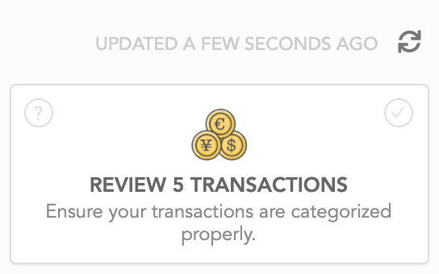

# Automatic Imports

## Introduction

We rely on [Plaid](https://plaid.com), a third-party banking provider, to import transactions and balances for your bank accounts. Plaid is a popular, secure and established service also used by a slew of other personal finance apps on the market. 

Currently, we are only legally allowed to provide this service to US & Canadian based banks. If you are based outside of this region, you may instead take advantage of our [CSV import tool](import-via-csv.md) or [developer API](developer-api.md) to get bulk transactions into Lunch Money.

## Support for international banks

We'd love to integrate with international banks for automatic imports, but unfortunately we're running into blockers due to data privacy laws as we're a Canadian-based company. 

Our highest priority right now is connecting to European and Australian banks for automatic imports. We're actively working with a number of data providers and waiting patiently for them to work with local regulators and hopefully pave the way for us one day to support our international users with automatic imports.

In the meantime, we have a [developer API ](https://developers.lunchmoney.app)which we're hoping will bridge the gap between Lunch Money & international banks. We already have a few European banks supported via community-made open source plugins such as [bunq](https://github.com/markjongkind/bunq-to-lunchmoney) and [Monzo](https://github.com/joehoyle/monzo-to-lunch-money)!

## FAQ

### Why does my account keep requiring me to relink/re-authenticate?

This is most likely related to a multi-factor authentication setting that you have enabled with your bank. In general, Plaid can handle 2FA. However, if a bank requires a unique one-time password on every login or otherwise very frequently, then Plaid will have difficulty maintaining connection. We always suggest checking to see if your bank provides you with app passwords or a setting to enable trusted devices– those would help Plaid maintain the connection!

### Why am I not seeing any transactions for my brokerage/investment accounts?

We're currently not able to get transactions for brokerage/investment accounts. We may be able to get the latest balance if the institution your account is associated with is not deemed an "investment-only bank". If it is, then we suggest creating a manually-managed asset to track the balance yourself.

The reason for this is simply because fetching transactions for brokerage/investment accounts costs  us much more money. At this point, we are choosing to focus mainly on tracking expenses and we are not pursuing to become an investment or portfolio tracking app.

### How do I fetch the latest transactions/balance? 

Balance and transactions are fetched automatically when we receive a notice via webhook from your bank & Plaid \(our third-party banking provider\) that there are new transactions. On rare occasions, this webhook doesn't arrive or somewhere along the line, something hiccups and we don't fetch the latest. In this case, you can manually trigger a fetch from the Transactions page by clicking on the refresh icon:

This operation is also automatically triggered if you go to the Transactions page and we determine that it's been over 12 hours since we last fetch transactions for your accounts.

